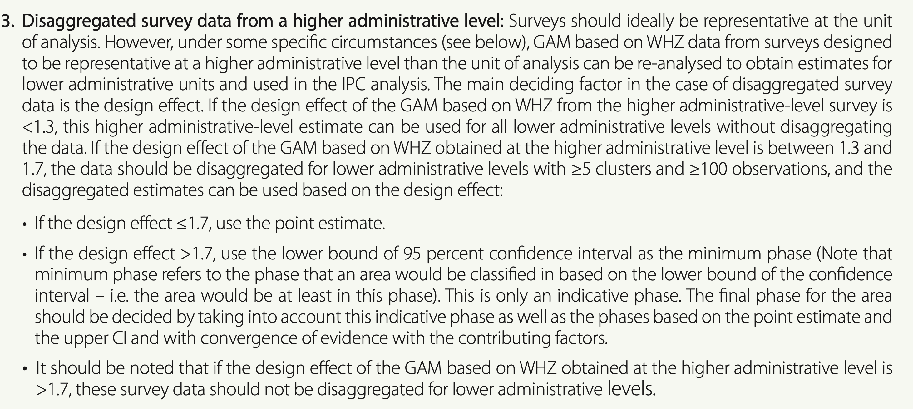
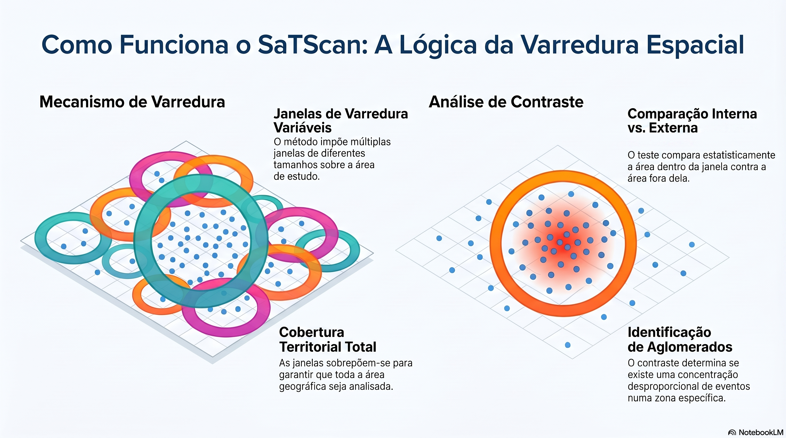
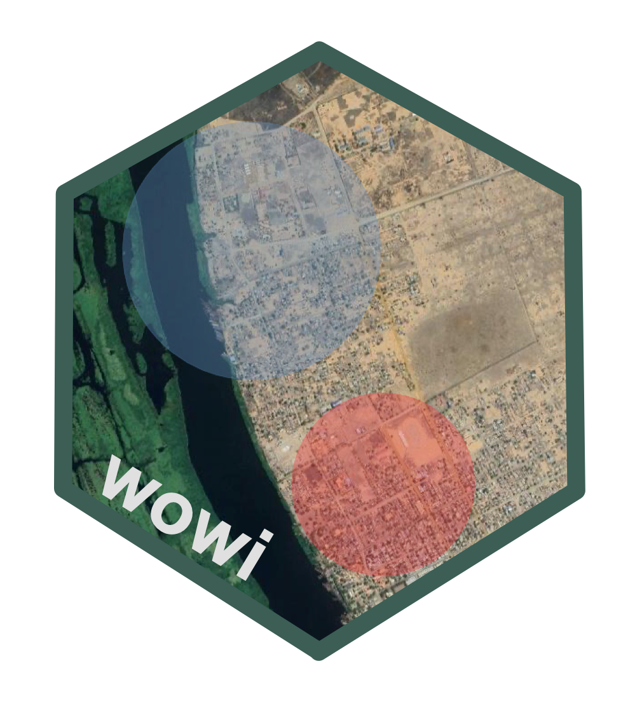
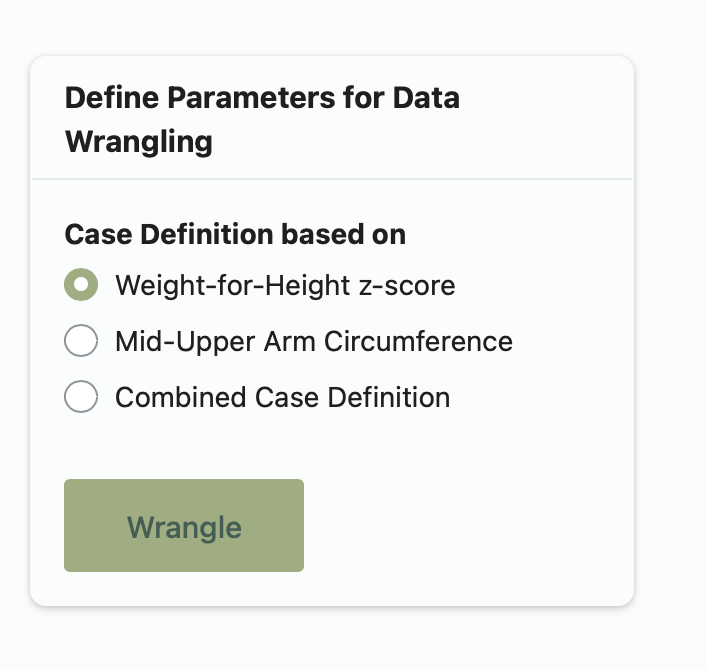

##
### Check on Software Installations {.smaller}
<br>
<br>

+ SaTScan version 3.10.5
+ R version 4.6.0 


## 
### Why caring about spatial analysis in the work we do? {.smaller} 

<br>

:::{.incremental}

+ Acute malnutrition may exhibit **spatial variability:** <br>

  - Over a survey area, some places may exhibit <span style="color: red">higher rates</span> than others, whereas others may exhibit <span style="color: blue;">lower rates</span>. <br>

  - This is acknowledged in the <span style="color:orange">SMART Methodology</span> as well as in the <span style="color:blue;">IPC</span>.

:::

##
### {.smaller}
#### In the SMART Methodology

Index of Dispersion

## 
### {.smaller}
#### In the IPC Manual v3.0: When Design Effect is > 1.3

```{=html}
<a href="https://www.ipcinfo.org/fileadmin/user_upload/ipcinfo/manual/IPC_Technical_Manual_3_Final.pdf" target="_blank"></a>
```

::: footer
Lear more: <a href=https://www.ipcinfo.org/fileadmin/user_upload/ipcinfo/manual/IPC_Technical_Manual_3_Final.pdf target="_blank">IPCinfo.org</a>
:::

# What are spatial clusters, and how are they detected? {.smaller}

##
### {.smaller}

> [Clustering]{.mark}, in spatial epidemiology, refers to the detection of "unusual" aggregation of disease. 

::: {style="text-align: right; color: grey;"}
-Lawson (2006)
:::

<br>

> Spatial epidemiology is often concerned with [location, size, and intensity]{.mark} of the clusters when studying local clustering.

::: {style="text-align: right; color: grey;"}
-Lawson et. al (2016)
:::

##
### Spatial Scan Tests of Clusters {.smaller} 

+ Proposed by [Martin Kulldorf](https://en-wikipedia-org.translate.goog/wiki/Martin_Kulldorff?_x_tr_sl=en&_x_tr_tl=pt&_x_tr_hl=pt&_x_tr_pto=tc)


:::{.callout-note}
### How does it work? 
+ The method imposes a large number of scanning windows of variable sizes onto the study area and compares the area inside against those outside the scanning windows.

+ The procedure of finding the [most-likely cluster]{.mark} is formulated using an hypothesis testing framework with a test statistisc based on the likelihood ratio test.
:::

:::{.callout-important}
### Models based on type of variable

There are several models, each depending on the type of variable that characterizes the phenomenon to be analysed.

- For [acute malnutrition]{.mark} a [Bernoulli model]{.mark} is used. It deals with [dichotomous variables]{.mark}: **cases** and **non-cases**
:::

## 
### nn

{fig-align="center"}


# Introduction to SaTScan Software {.smaller}

::: footer
Learn more: [SaTScan](https://www.satscan.org)
:::

#
```{=html}
<div id="intro-wowi">
  <h1 style="float: left; font-family: Roboto; font-size:60px; margin-top: 150px;">Introduction to wowi Software</h1>
</div>
```

```{=html}
<div id="wowi">
  
</div>
```

::: footer
Learn more: [wowi](https://tiwowi.github.io/wowi/)
:::


## {.smaller}
### What is <code>wowi</code> ? 🧐

<br> 

:::{.incremental}

+ <code>wowi</code> means [*where*]{.mark} in ___Elómwè___ <br> <br>
+ A lightweight, field-ready R-powered software built on top of SaTScan. <br> <br> 

+ Currently, it only suppports the scanning of spatial clusters of [global acute malnutrition only]{.underline}. <br> <br>

+ It depends on: 
  - SaTScan for the actual spatial scan
  - <code>mwana</code> for wrangling of anthropometric data before piping into SaTScan analysis workflow. <br> <br>

+ Users must have SaTScan installed on their computer; in spite of that, users will never have to open SaTScan - <code>wowi</code> communicates internally with SaTScan to run the analysis needless to manually. <br> <br>

+ User will only have to open <code>wowi</code> app user iterfarce and give the instructions to SaTScan from there.

:::


## {.smaller}
### Installing <code>wowi</code> library in R

+ Install <code>remotes</code> library. 
+ Type/copy and paste the following command:

```{r}
#| eval: false
#| label: install-remotes
#| echo: true
install.packages("remotes")
```

<br>

+ Then, install <code>wowi</code> with the following command: 

```{r}
#| eval: false
#| label: instal-wowi
#| echo: true
remotes::install_github(repo = "tiwowi/wowi", dependencies = TRUE)
```

<br>

+ Once installed, launch the app running the following command: 

```{r}
#| eval: false
#| label: run-wowi
#| echo: true
wowi::ww_run_app()
```

<br>

+ The above code will open <code>wowi</code> app on your default web browser. 


## {.smaller}
### Understanding data wrangling process in wowi

+ <code>wowi</code> lets you scan for spatial clusters of global acute malnutrition defined on the basis of the following methods: 

:::: {.columns}

::: {.column width="50%"}

:::

::: {.column}
::: {.incremental}
+ **Weight-for-Height z-score** applies the SMART flagging criterion of +/-3 zscores of the survey mean. <br>

+ **Mid-Upper Arm Circumference**: it calculates z-scores of MUAC-for-Age, and then identifies outliers applying the same criterion of +/-3 z-scores of the survey mean. <br>

+ [**Combined Prevalence**](https://mphimo.github.io/mwana/reference/mw_estimate_prevalence_combined.html): It applyies flagging criterion on weight-for-height and on MUAC-for-Age zscores separately, then it removes flagged records in each.

:::
:::
::::


::: footer
Learn more: [mwana](https://mphimo.github.io/mwana/)
:::